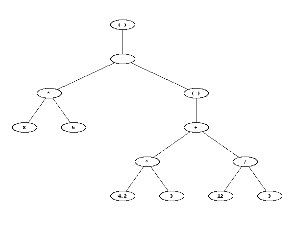

# Telegram Calculator Bot

A telegram bot that can act as an calculator.
The bot can handle private messages as well as inline requests.
However it is not currently hosted anywhere, so you will have to deploy it yourself to use it.
It works by translating the expression into a tree where the nodes represent the associated operations or numbers.
So this bot does not enable remote code execution by carelessly using `eval` or `exec` to evaluate the expression.
Here is an example for the expression "3\*5 - (4.2^3 + 12 / 3)" for which the bot replies with the correct solution "-63.088":



The help messages states:
> You can use decimal numbers, parentheses and the operators \*, /, +, -, ^, %. You can also perform multiple calculations in one message by placing the expressions in $...$.
> For example: 'The area of a rectangle with side lengths 3 and 4 is $3\*4$, the circumference is $2\*(3+4)$'

## Running it

You need to request a token from the telegram BotFather and save it in a file called `_token.py` in the same directory as `main.py` in following form:

```python
token = "<your token here>"
```

Then you can simply run the bot by using `python3 main.py` or `python3 main.py n` to handle only the next `n` requests, where n is an integer.
